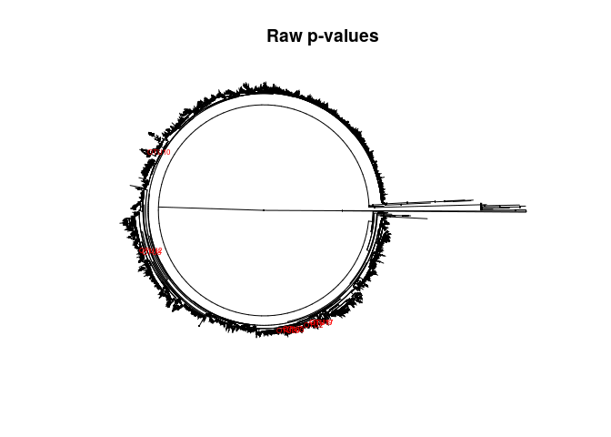

This package is now available through the CRAN repository [POSTm package](https://cran.r-project.org/web/packages/POSTm/index.html)

     

Introduction
------------

The **POSTm** package implements the phylogeny-guided microbiome
OTU-specific association test as described in Huang et al. 2021. This
method boosts the testing power by adaptively borrowing information from
phylogenetically close OTUs of the target OTU. Whether or not borrowing
information or the amount of information from the neighboring OTUs is
data adaptive and supervised by phylogenetic distance and the outcome
variable. **POSTm** is built on a kernel machine regression framework
and inherited its advantages including flexible modeling of microbiome
effects (e.g., effects from opposite direction), easy adjustment for
covariates, and accommodation of both continuous and binary outcomes.
**POSTm** extends the current global kernel tests of Zhao, et al.
(2015), Wu, et al. (2016), and Koh, et al. (2017) to OTU-level testing
using an OTU-specific kernel. Currently, **POSTm** uses the Aitchison
distance to quantify microbiome dissimilarity between individual pairs.

The primary analysis tool of the package is *post()*, which implements
the phylogeny-guided microbiome OTU-specific association test. In
addition, the package includes convenience functions *p.adjust()*,
providing standard multiple adjustment methods; *plot()*, which extends
the plotting capabilities of the **ape** package to highlight
significant OTUs; and *print()*, which allows for informative or
controlled screen prints of the primary results.

Functions
---------

### *post()*

The function call takes the following form:

    post(y, OTU, tree = NULL, X = NULL, cValues = seq(from = 0, to = 0.05, by = 0.01))

where required input <tt>y</tt> is a binary or continuous outcome of
interest and <tt>OTU</tt> is a matrix of operational taxonomic units
(OTUs) and can be either counts or proportions. The optional input
<tt>tree</tt> can take one of three forms: (1) a full phylogenetic tree
of class “phylo” as defined by R package **ape**; (2) a matrix of the
pairwise distances between all OTUs of the full tree as defined by their
branch lengths; or (3) NULL, which limits the analysis to only the
single OTU test. Note that for forms (1) and (2), if the tree contains
more identifiers than provided through <tt>OTU</tt>, the tree should
**NOT** be truncated or subset (See Huang et al. (2021) discussion
section for details). Input <tt>X</tt> is a matrix of covariates (not
including intercept) used to model the outcome of interest or NULL,
indicating an intercept only model. Finally, <tt>cValues</tt> is a
vector of tuning parameters used to control how fast the OTU correlation
decreases when the between-OTU distance increases. If the length of
input <tt>cValues</tt> is greater than 1, an ‘optimal’ for each OTU will
be identified based on the p-values.

The value object returned by *post()* is an S3 object of class “POST”.
Objects of this class contain a matrix providing the POST and/or single
OTU p-values and the ‘optimal’ tuning parameters and have an attribute
“tree” containing the object passed through input <tt>tree</tt> for use
in post-analysis tools.

### *p.adjust()*

This function extends the *p.adjust()* method of the **stats** package
to accommodate objects of class “POST” and incorporates an additional
test as provided through *mt.rawp2adjp()* of packgae *multtest*. When
provided a “POST” object, this function calculates the adjusted POST
and/or single OTU p-values using one or more of the following methods:
“bonferroni”, “holm”, “hochberg”, “hommel”, “BH”, “BY”, or “TSBH”.
Details regarding these tests can be found in the original help files,
i.e., ?stats::p.adjust and ?multtest::mt.rawp2adjp.

The function call takes the following form:

    p.adjust(p, ..., method = p.adjust.methods, n = length(x = p), alpha = 0.05)

where <tt>p</tt> is a “POST” object, <tt>method</tt> is one or more
adjustment methods, <tt>n</tt> is the number of comparisons, and
<tt>alpha</tt> is the type I error rate used for estimating the number
of true null hypotheses if the two-stage Benjamini & Hochberg (TSBH)
procedure is selected.

The value object returned is a list object, the elements of which depend
on the original tests selected. For all analyses, the list will contain
element <tt>$adjSO</tt>, which provides a matrix of the raw and adjusted
single OTU p-values. For analyses that also included POST, the list will
contain element <tt>$adjPOST</tt>, which provides a matrix of the raw
and adjusted POST p-values.

### *plot()*

This function extends the plotting capabilities of the **ape** package
so that significant OTUs are highlighted. The function call is as
follows:

    plot(x, ..., siglevel = 0.05, method = "none", alpha = 0.05, subTree = TRUE)

where <tt>x</tt> is a “POST” object, <tt>siglevel</tt> is the threshold
for “significant” p-values, <tt>method</tt> is a p-value adjustment
method as described above for *p.adjust()* (<tt>method</tt> = “none”
uses the raw p-values), <tt>alpha</tt> is the type I error rate if
<tt>method</tt> = “TSBH”, and <tt>subTree</tt> is a logical indicating
if only the tips used in the original analysis should be included in the
plot. The ellipsis can be used to control most inputs to the original
*plot()* method as defined by **ape**. See ?ape::plot.phylo for further
information on available options.

### *print()*

This convenience function extends the standard print method to allow for
selection of p-values below a specified threshold.

    print(x, ..., siglevel = 1.0)

prints the POST and/or SO p-values only for those OTUs with p-values
below <tt>siglevel</tt>. When siglevel = 1, all OTUs are printed.

Examples
--------

A dataset has been provided with the package to facilitate illustration.
The data are adapted from the vaginal microbiome dataset from
Subramaniam et al. (2016). The original dataset consists of 39
individuals with 19 bacterial vaginosis (BV) patients and 20 healthy
controls. The sequencing data and metadata are publicly available at
NCBI SRA database (PRJNA600021). Initial data processing leads to 2711
OTUs formed at 97% similarity. FastTree (Price et al, 2010) was used to
construct the phylogenetic tree. We further filtered the OTUs excluding
those with abundance  &lt; 0.005% and prevalence  &lt; 10%, which
reduced the number of OTUs to 189. The data can be loaded into the
environment as follows

    library("POSTm")
    data("POSTmData")

There are four objects now loaded into the environment:
<tt>metadata</tt>, a data.frame object containing patient ids, a
dichotomous race indicator (coded as “B”/“C”), and a binary health
status (coded as “BV”/“Normal”); <tt>OTU</tt>, a matrix of OTU counts;
<tt>otutree</tt>, a phylogenetic tree of class “phylo”; and
<tt>otuseq</tt>, a character vector of OTU sequences.

Ultimately, we will aim to detect the OTUs that are significantly
different between the BV group and the control with adjustment for race.
However, we will start with the simplest call structure and introduce
features and capabilities gradually.

The outcome of interest is the health status, column “GC” of metadata

    y <- as.integer(metadata[,"GC"] == "BV")

where y = 1 for participants experiencing bacterial vaginosis and 0
otherwise.

### Example 1

First, we consider the simplest analysis that includes both the POST and
single-OTU tests. We assume an intercept only model for the outcome
regression, and provide the phylogenetic tree. For brevity, we limit
these early examples to only the first 20 OTUs. The analysis is
initiated by the following call

    result1 <- post(y = y, OTU = otu[,1L:20L], tree = otutree)

    ## intercept only outcome regression model

    ## OTU type identified as counts

    ## response type identified as binary

    ## tree input identified as a phylogenetic tree

    ## cvalue: 0

    ## OTU: 10 20 
    ## cvalue: 0.01
    ## OTU: 10 20 
    ## cvalue: 0.02
    ## OTU: 10 20 
    ## cvalue: 0.03
    ## OTU: 10 20 
    ## cvalue: 0.04
    ## OTU: 10 20 
    ## cvalue: 0.05
    ## OTU: 10 20

Most of the informative messages generated by the software are provided
for verification purposes. It is strongly recommended that users review
the information to ensure that the software properly identifies the
outcome type, the OTU type, the tree type, and the chosen model. In this
example, we see that an intercept only model was used, that the OTU type
is identified as counts, that the response was determined to be binary,
and that the tree is a phlyogenetic tree. The remaining information is
generated to provide status information regarding the c-value and
approximate OTU under evaluation.

The value object returned is of class “POST”

    class(x = result1)

    ## [1] "POST"

for which all of the previously described convenience functions are
available. The *print()* function provides a complete or partial list of
the single-OTU p-values

    print(x = result1)

    ##       POST_pvalue SO_pvalue Best_C
    ## OTU3      0.00072   0.00046   0.00
    ## OTU7      0.00125   0.04380   0.01
    ## OTU2      0.00234   0.89844   0.03
    ## OTU12     0.01823   0.01128   0.00
    ## OTU20     0.04021   0.17447   0.05
    ## OTU8      0.13094   0.36796   0.03
    ## OTU17     0.16291   0.87385   0.05
    ## OTU19     0.17471   0.45100   0.05
    ## OTU10     0.18894   0.18886   0.01
    ## OTU4      0.32380   0.22141   0.00
    ## OTU16     0.32472   0.40973   0.05
    ## OTU9      0.34788   0.34798   0.05
    ## OTU18     0.36871   0.41272   0.02
    ## OTU6      0.46645   0.52395   0.05
    ## OTU5      0.62724   0.62724   0.05
    ## OTU13     0.62744   0.63846   0.05
    ## OTU11     0.72837   0.78678   0.05
    ## OTU15     0.74306   0.74405   0.05
    ## OTU14     0.77073   0.75270   0.00
    ## OTU1      0.96079   0.96727   0.05

from which we see that the raw POST p-values are given in the first
column of the returned matrix (<tt>$POST\_pvalue</tt>), the second
column contains the raw single OTU p-values (<tt>$SO\_pvalue</tt>), and
the first c-value corresponding to the smallest p-value for each OTU is
returned in the third column (<tt>$Best\_C</tt>). Though not necessary
given the limited number of OTUs included in this example, the print
statement can be limited to only the most significant OTUs by providing
<tt>siglevel</tt>.

    print(x = result1, siglevel = 0.04)

    ## POST: p-values <=  0.04 
    ##       POST_pvalue SO_pvalue Best_C
    ## OTU3      0.00072   0.00046   0.00
    ## OTU7      0.00125   0.04380   0.01
    ## OTU2      0.00234   0.89844   0.03
    ## OTU12     0.01823   0.01128   0.00
    ## 
    ## Single OTU test: p-values <=  0.04 
    ##       SO_pvalue
    ## OTU3    0.00046
    ## OTU12   0.01128

which truncates the printed results to only those OTUs with p-values ≤
0.04.

To obtain adjusted p-values, we can use function *p.adjust()*. All
available adjustment methods can be retrieved by providing only the
“POST” object

    p.adjust(p = result1)

    ## $adjPOST
    ##           raw    holm hochberg  hommel bonferroni      BH        BY     fdr
    ## OTU3  0.00072 0.04320  0.04320 0.04248     0.0432 0.03750 0.1754951 0.03750
    ## OTU7  0.00125 0.07375  0.07375 0.07250     0.0750 0.03750 0.1754951 0.03750
    ## OTU2  0.00234 0.13572  0.13572 0.13572     0.1404 0.04680 0.2190179 0.04680
    ## OTU12 0.01823 1.00000  1.00000 1.00000     1.0000 0.27345 1.0000000 0.27345
    ## OTU20 0.04021 1.00000  1.00000 1.00000     1.0000 0.48252 1.0000000 0.48252
    ## OTU8  0.13094 1.00000  1.00000 1.00000     1.0000 1.00000 1.0000000 1.00000
    ## OTU17 0.16291 1.00000  1.00000 1.00000     1.0000 1.00000 1.0000000 1.00000
    ## OTU19 0.17471 1.00000  1.00000 1.00000     1.0000 1.00000 1.0000000 1.00000
    ## OTU10 0.18894 1.00000  1.00000 1.00000     1.0000 1.00000 1.0000000 1.00000
    ## OTU4  0.32380 1.00000  1.00000 1.00000     1.0000 1.00000 1.0000000 1.00000
    ## OTU16 0.32472 1.00000  1.00000 1.00000     1.0000 1.00000 1.0000000 1.00000
    ## OTU9  0.34788 1.00000  1.00000 1.00000     1.0000 1.00000 1.0000000 1.00000
    ## OTU18 0.36871 1.00000  1.00000 1.00000     1.0000 1.00000 1.0000000 1.00000
    ## OTU6  0.46645 1.00000  1.00000 1.00000     1.0000 1.00000 1.0000000 1.00000
    ## OTU5  0.62724 1.00000  1.00000 1.00000     1.0000 1.00000 1.0000000 1.00000
    ## OTU13 0.62744 1.00000  1.00000 1.00000     1.0000 1.00000 1.0000000 1.00000
    ## OTU11 0.72837 1.00000  1.00000 1.00000     1.0000 1.00000 1.0000000 1.00000
    ## OTU15 0.74306 1.00000  1.00000 1.00000     1.0000 1.00000 1.0000000 1.00000
    ## OTU14 0.77073 1.00000  1.00000 1.00000     1.0000 1.00000 1.0000000 1.00000
    ## OTU1  0.96079 1.00000  1.00000 1.00000     1.0000 1.00000 1.0000000 1.00000
    ##            TSBH
    ## OTU3  0.0106250
    ## OTU7  0.0106250
    ## OTU2  0.0132600
    ## OTU12 0.0774775
    ## OTU20 0.1367140
    ## OTU8  0.3568867
    ## OTU17 0.3568867
    ## OTU19 0.3568867
    ## OTU10 0.3568867
    ## OTU4  0.4821592
    ## OTU16 0.4821592
    ## OTU9  0.4821592
    ## OTU18 0.4821592
    ## OTU6  0.5664036
    ## OTU5  0.6666550
    ## OTU13 0.6666550
    ## OTU11 0.6896005
    ## OTU15 0.6896005
    ## OTU14 0.6896005
    ## OTU1  0.8166715
    ## 
    ## $adjSO
    ##           raw    holm hochberg  hommel bonferroni     BH        BY    fdr
    ## OTU3  0.00046 0.02760  0.02760 0.02760     0.0276 0.0276 0.1291644 0.0276
    ## OTU7  0.04380 1.00000  1.00000 1.00000     1.0000 0.8760 1.0000000 0.8760
    ## OTU2  0.89844 1.00000  1.00000 1.00000     1.0000 1.0000 1.0000000 1.0000
    ## OTU12 0.01128 0.66552  0.66552 0.66552     0.6768 0.3384 1.0000000 0.3384
    ## OTU20 0.17447 1.00000  1.00000 1.00000     1.0000 1.0000 1.0000000 1.0000
    ## OTU8  0.36796 1.00000  1.00000 1.00000     1.0000 1.0000 1.0000000 1.0000
    ## OTU17 0.87385 1.00000  1.00000 1.00000     1.0000 1.0000 1.0000000 1.0000
    ## OTU19 0.45100 1.00000  1.00000 1.00000     1.0000 1.0000 1.0000000 1.0000
    ## OTU10 0.18886 1.00000  1.00000 1.00000     1.0000 1.0000 1.0000000 1.0000
    ## OTU4  0.22141 1.00000  1.00000 1.00000     1.0000 1.0000 1.0000000 1.0000
    ## OTU16 0.40973 1.00000  1.00000 1.00000     1.0000 1.0000 1.0000000 1.0000
    ## OTU9  0.34798 1.00000  1.00000 1.00000     1.0000 1.0000 1.0000000 1.0000
    ## OTU18 0.41272 1.00000  1.00000 1.00000     1.0000 1.0000 1.0000000 1.0000
    ## OTU6  0.52395 1.00000  1.00000 1.00000     1.0000 1.0000 1.0000000 1.0000
    ## OTU5  0.62724 1.00000  1.00000 1.00000     1.0000 1.0000 1.0000000 1.0000
    ## OTU13 0.63846 1.00000  1.00000 1.00000     1.0000 1.0000 1.0000000 1.0000
    ## OTU11 0.78678 1.00000  1.00000 1.00000     1.0000 1.0000 1.0000000 1.0000
    ## OTU15 0.74405 1.00000  1.00000 1.00000     1.0000 1.0000 1.0000000 1.0000
    ## OTU14 0.75270 1.00000  1.00000 1.00000     1.0000 1.0000 1.0000000 1.0000
    ## OTU1  0.96727 1.00000  1.00000 1.00000     1.0000 1.0000 1.0000000 1.0000
    ##            TSBH
    ## OTU3  0.0087400
    ## OTU7  0.1071600
    ## OTU2  0.2774000
    ## OTU12 0.7011317
    ## OTU20 0.7011317
    ## OTU8  0.7011317
    ## OTU17 0.7790000
    ## OTU19 0.7790000
    ## OTU10 0.7790000
    ## OTU4  0.7790000
    ## OTU16 0.7790000
    ## OTU9  0.8295875
    ## OTU18 0.8664814
    ## OTU6  0.8664814
    ## OTU5  0.8793424
    ## OTU13 0.8793424
    ## OTU11 0.8793424
    ## OTU15 0.8984400
    ## OTU14 0.8984400
    ## OTU1  0.9189065

Note that if package **multtest** is not installed, TSBH will not be returned. 

We can also choose to limit this result to one or more methods, using
input <tt>method</tt>

    p.adjust(p = result1, method = c("holm", "BH"))

    ## $adjPOST
    ##           raw    holm      BH
    ## OTU3  0.00072 0.04320 0.03750
    ## OTU7  0.00125 0.07375 0.03750
    ## OTU2  0.00234 0.13572 0.04680
    ## OTU12 0.01823 1.00000 0.27345
    ## OTU20 0.04021 1.00000 0.48252
    ## OTU8  0.13094 1.00000 1.00000
    ## OTU17 0.16291 1.00000 1.00000
    ## OTU19 0.17471 1.00000 1.00000
    ## OTU10 0.18894 1.00000 1.00000
    ## OTU4  0.32380 1.00000 1.00000
    ## OTU16 0.32472 1.00000 1.00000
    ## OTU9  0.34788 1.00000 1.00000
    ## OTU18 0.36871 1.00000 1.00000
    ## OTU6  0.46645 1.00000 1.00000
    ## OTU5  0.62724 1.00000 1.00000
    ## OTU13 0.62744 1.00000 1.00000
    ## OTU11 0.72837 1.00000 1.00000
    ## OTU15 0.74306 1.00000 1.00000
    ## OTU14 0.77073 1.00000 1.00000
    ## OTU1  0.96079 1.00000 1.00000
    ## 
    ## $adjSO
    ##           raw    holm     BH
    ## OTU3  0.00046 0.02760 0.0276
    ## OTU7  0.04380 1.00000 0.8760
    ## OTU2  0.89844 1.00000 1.0000
    ## OTU12 0.01128 0.66552 0.3384
    ## OTU20 0.17447 1.00000 1.0000
    ## OTU8  0.36796 1.00000 1.0000
    ## OTU17 0.87385 1.00000 1.0000
    ## OTU19 0.45100 1.00000 1.0000
    ## OTU10 0.18886 1.00000 1.0000
    ## OTU4  0.22141 1.00000 1.0000
    ## OTU16 0.40973 1.00000 1.0000
    ## OTU9  0.34798 1.00000 1.0000
    ## OTU18 0.41272 1.00000 1.0000
    ## OTU6  0.52395 1.00000 1.0000
    ## OTU5  0.62724 1.00000 1.0000
    ## OTU13 0.63846 1.00000 1.0000
    ## OTU11 0.78678 1.00000 1.0000
    ## OTU15 0.74405 1.00000 1.0000
    ## OTU14 0.75270 1.00000 1.0000
    ## OTU1  0.96727 1.00000 1.0000

When a tree is provided for the analysis, a graphical depiction of the
tree with significant OTUs highlighted can be obtained using *plot()*.
To highlight OTUs based on the raw p-values use

    plot(x = result1, siglevel = 0.2)

An alternative is to highlight based on the adjusted p-values. For
example, to use the BH adjusted p-values

    plot(x = result1, siglevel = 0.2, method = "BH")

If the full tree is of interest, we can set <tt>subTree=FALSE</tt>;
though for large trees this can be difficult to read and/or interpret

    plot(x = result1, siglevel = 0.2, subTree = FALSE)

### Example 2

The next level of complexity is to include a more complicated model of
the outcome. The only additional covariate available through our dataset
is the binary race indicator. We’ll use the following simple model
*l**o**g**i**t*(*Y*) ∼ *β*0 + *β*1 *m**R**a**c**e*

    X <- metadata$mRace

    result2 <- post(y = y, OTU = otu[,1L:20L], X = X, tree = otutree)

    ## 1 covariate(s) included in outcome regression model

    ## OTU type identified as counts

    ## response type identified as binary

    ## tree input identified as a phylogenetic tree

    ## cvalue: 0

    ## OTU: 10 20 
    ## cvalue: 0.01
    ## OTU: 10 20 
    ## cvalue: 0.02
    ## OTU: 10 20 
    ## cvalue: 0.03
    ## OTU: 10 20 
    ## cvalue: 0.04
    ## OTU: 10 20 
    ## cvalue: 0.05
    ## OTU: 10 20

Note that the informative messages now indicate that 1 covariate is
included in the model. The previously described post-analysis tools can
also be applied to this result.

### Example 3

In the event that the phylogenetic tree is not available in a format
conducive with class “phylo”, the user can instead provide a distance
matrix defined by the branch lengths between OTUs. This matrix must be
symmetric, of dimensions greater than or equal to the number of OTUs
provided in input <tt>OTU</tt>, have zero valued diagonal elements, and
column and row names exactly as those provided in the column headers of
<tt>OTU</tt>. To illustrate this feature, we simply use the
functionality of package **ape** to define the distance matrix prior to
calling *post()*.

    Dmat <- ape::cophenetic.phylo(x = otutree)

We see that the matrix is symmetric, that diagonal elements are 0, and
that the column headers of the OTU are included in the row and column
names of the distance matrix

    # symmetric
    all.equal(target = Dmat[lower.tri(x = Dmat)], 
              current = t(x = Dmat)[lower.tri(x = Dmat)])

    ## [1] TRUE

    # zero diagonal
    sum(abs(x = diag(x = Dmat)))

    ## [1] 0

    # correct names
    all(colnames(x = otu) %in% rownames(x = Dmat))

    ## [1] TRUE

    all(colnames(x = otu) %in% colnames(x = Dmat))

    ## [1] TRUE

    result3 <- post(y = y, OTU = otu[,1L:20L], X = X, tree = Dmat)

    ## 1 covariate(s) included in outcome regression model

    ## OTU type identified as counts

    ## response type identified as binary

    ## tree input identified as a distance matrix

    ## cvalue: 0

    ## OTU: 10 20 
    ## cvalue: 0.01
    ## OTU: 10 20 
    ## cvalue: 0.02
    ## OTU: 10 20 
    ## cvalue: 0.03
    ## OTU: 10 20 
    ## cvalue: 0.04
    ## OTU: 10 20 
    ## cvalue: 0.05
    ## OTU: 10 20

We see from the information messages that the tree was internally
identified as a distance matrix. The results are equivalent to those
obtained in Example 2.

    print(x = result3, siglevel = 0.04)

    ## POST: p-values <=  0.04 
    ##       POST_pvalue SO_pvalue Best_C
    ## OTU3      0.00065   0.00040   0.00
    ## OTU7      0.00120   0.04743   0.01
    ## OTU2      0.00238   0.90479   0.03
    ## OTU12     0.01964   0.01209   0.00
    ## 
    ## Single OTU test: p-values <=  0.04 
    ##       SO_pvalue
    ## OTU3    0.00040
    ## OTU12   0.01209

    p.adjust(p = result3, method = "bonferroni")

    ## $adjPOST
    ##           raw bonferroni
    ## OTU3  0.00065     0.0390
    ## OTU7  0.00120     0.0720
    ## OTU2  0.00238     0.1428
    ## OTU12 0.01964     1.0000
    ## OTU20 0.04283     1.0000
    ## OTU8  0.13821     1.0000
    ## OTU17 0.18830     1.0000
    ## OTU19 0.19656     1.0000
    ## OTU10 0.19783     1.0000
    ## OTU16 0.33856     1.0000
    ## OTU4  0.33940     1.0000
    ## OTU9  0.35929     1.0000
    ## OTU18 0.38382     1.0000
    ## OTU6  0.46897     1.0000
    ## OTU5  0.63680     1.0000
    ## OTU13 0.64651     1.0000
    ## OTU11 0.74256     1.0000
    ## OTU15 0.75373     1.0000
    ## OTU14 0.79008     1.0000
    ## OTU1  0.96161     1.0000
    ## 
    ## $adjSO
    ##           raw bonferroni
    ## OTU3  0.00040     0.0240
    ## OTU7  0.04743     1.0000
    ## OTU2  0.90479     1.0000
    ## OTU12 0.01209     0.7254
    ## OTU20 0.18278     1.0000
    ## OTU8  0.38092     1.0000
    ## OTU17 0.87408     1.0000
    ## OTU19 0.46364     1.0000
    ## OTU10 0.19775     1.0000
    ## OTU16 0.42348     1.0000
    ## OTU4  0.23187     1.0000
    ## OTU9  0.35938     1.0000
    ## OTU18 0.42107     1.0000
    ## OTU6  0.51994     1.0000
    ## OTU5  0.63680     1.0000
    ## OTU13 0.65635     1.0000
    ## OTU11 0.79935     1.0000
    ## OTU15 0.75461     1.0000
    ## OTU14 0.77039     1.0000
    ## OTU1  0.96670     1.0000

Because a tree object was not provided, the plot functionality is not
available for this example.

    try(expr = plot(x = result3))

    ## Error in plot.POST(x = result3) : tree is not of an appropriate class

### Example 4

If neither a tree object nor distance matrix can be generated,
<tt>tree</tt> can be specified as NULL, which triggers only the single
OTU test. Note that this choice of test means that the cValues are
ignored as they do not play a role. For brevity of results, we limit
this analysis to only the first 20 OTUs.

    result4 <- post(y = y, OTU = otu[,1L:20L])

    ## intercept only outcome regression model

    ## OTU type identified as counts

    ## response type identified as binary

    ## no tree provided; performing single OTU test

    ## cvalue: 0

    ## OTU: 10 20

Note, that the informative messages indicate that no tree was provided
and that only the single OTU test was calculated.

The *print()* function provides a complete or partial list of only the
single-OTU p-values

    print(x = result4)

    ##       SO_pvalue
    ## OTU14   0.03249
    ## OTU19   0.03283
    ## OTU15   0.03338
    ## OTU1    0.03481
    ## OTU13   0.03529
    ## OTU17   0.03729
    ## OTU8    0.03912
    ## OTU6    0.03984
    ## OTU4    0.04022
    ## OTU5    0.04041
    ## OTU11   0.04067
    ## OTU2    0.04077
    ## OTU9    0.04190
    ## OTU16   0.04224
    ## OTU20   0.04272
    ## OTU18   0.04311
    ## OTU10   0.04329
    ## OTU7    0.05208
    ## OTU12   0.05593
    ## OTU3    0.42849

from which we the single OTU p-values in the column labeled
<tt>$SO\_pvalue</tt>.

Plot methods are not available for this example, as a tree object was
not provided.

    try(expr = plot(x = result4))

    ## Error in plot.POST(x = result4) : no tree provided in original analysis

### Example 5

For this full feature example, we include the full dataset containing
189 OTUs. Further, we will adjust the c-values considered in the
analysis. Note that this change is not recommended, we do so here only
for illustration. If the maximum c-value is  &gt; 0.05, a warning
message will be produced.

    result5 <- post(y = y, OTU = otu, X = X, tree = otutree, 
                    cValues = c(0.03,0.045,0.06))

    ## 1 covariate(s) included in outcome regression model

    ## OTU type identified as counts

    ## response type identified as binary

    ## tree input identified as a phylogenetic tree

    ## Warning in post(y = y, OTU = otu, X = X, tree = otutree, cValues = c(0.03, : the
    ## maximum cvalue is larger than the recommended value of 0.05; this may result in
    ## more false positives. See Huang et al. (2021) discussion section for details.

    ## cvalue: 0

    ## OTU: 10 20 30 40 50 60 70 80 90 100 
    ## 110 120 130 140 150 160 170 180 
    ## cvalue: 0.03
    ## OTU: 10 20 30 40 50 60 70 80 90 100 
    ## 110 120 130 140 150 160 170 180 
    ## cvalue: 0.045
    ## OTU: 10 20 30 40 50 60 70 80 90 100 
    ## 110 120 130 140 150 160 170 180 
    ## cvalue: 0.06
    ## OTU: 10 20 30 40 50 60 70 80 90 100 
    ## 110 120 130 140 150 160 170 180

Notice the warning message generated indicating that this analysis has
exceeded the recommended maximum c-value of 0.05. In addition, we see
that the value *c* = 0 has been added to the analysis as this is
required for the single OTU test.

All previously described convenience functions are available for the
returned value object.

    print(x = result5, siglevel = 0.01)

    ## POST: p-values <=  0.01 
    ##        POST_pvalue SO_pvalue Best_C
    ## OTU3       0.00038   0.00025  0.000
    ## OTU90      0.00060   0.83772  0.030
    ## OTU7       0.00079   0.09350  0.030
    ## OTU82      0.00080   0.90564  0.030
    ## OTU66      0.00095   0.01422  0.060
    ## OTU2       0.00097   0.33941  0.045
    ## OTU58      0.00105   0.35411  0.060
    ## OTU36      0.00348   0.42616  0.030
    ## OTU228     0.00492   0.00592  0.045
    ## OTU32      0.00644   0.07177  0.045
    ## OTU191     0.00670   0.03632  0.030
    ## OTU65      0.00880   0.29440  0.045
    ## OTU175     0.00979   0.01933  0.060
    ## 
    ## Single OTU test: p-values <=  0.01 
    ##        SO_pvalue
    ## OTU3     0.00025
    ## OTU228   0.00592

    pv <- p.adjust(p = result5, method = "BH")
    head(pv$adjPOST)

    ##           raw      BH
    ## OTU3  0.00038 0.08505
    ## OTU90 0.00060 0.08505
    ## OTU7  0.00079 0.08505
    ## OTU82 0.00080 0.08505
    ## OTU66 0.00095 0.08505
    ## OTU2  0.00097 0.08505

    head(pv$adjSO)

    ##           raw      BH
    ## OTU3  0.00025 0.14175
    ## OTU90 0.83772 1.00000
    ## OTU7  0.09350 1.00000
    ## OTU82 0.90564 1.00000
    ## OTU66 0.01422 1.00000
    ## OTU2  0.33941 1.00000

    plot(x = result5, method = "BY", alpha = 0.01)

    ## Warning in plot.POST(x = result5, method = "BY", alpha = 0.01): no p-values
    ## below provided significant level

Huang, C., Callahan, B., Wu, M. C., Holloway, S. T., Brochu, H., Lu, W.,
Peng, X., and Tzeng, J-Y. (2021). Phylogeny-guided microbiome
OTU-specific association test (POST). *Bioinformatics*, under revision.

Koh, H., Blaser, M. J., and Li, H., (2017). A powerful microbiome-based
association test and a microbial taxa discovery framework for
comprehensive association mapping. *Microbiome*, **5**(1), 45.

Subramaniam, A., Kumar, R., Cliver, S. P., Zhi, D., Szychowski, J. M.,
Abramovici, A., Biggio, J. R., Leftkowitz, E. J., Morrow, C., and
Edwards, R., K. (2016). Vaginal microbiota in pregnancy: Evaluation
based on vaginal flora, birth outcome, and race. *American Journal of
Perinatology*, **33**(04), 401–408.

Wu, C., Chen, J., Kim, J., and Pan, W. (2016). An adaptive association
test for microbiome data. *Genome Medicine*, **81**(1), 56.

Zhao, N., Chen, J., Carroll, I. M., Ringel-Kulka, T., Epstein, M. P.,
Zhou, H., Zhou, J. J., Tingel, Y., Li, H., and Wu, M. C. (2015). Testing
in microbiome-profiling studies with mirkat, the microbiome
regression-based kernel association test. *The American Journal of Human
Genetics*, **96**(5), 797–807.
